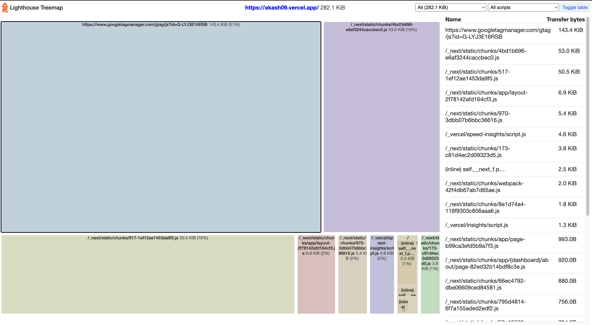

## home page :

- google tag manager ewww.

### Links do not have a discernible name

## unlighthouse
- pnpm dlx unlighthouse --site http://localhost:3000/


## ✅ Step 3 — Add Optimized GA
- In layout.tsx:
import { GoogleAnalytics } from "@next/third-parties/google";
Inside <body> (after {children}):
<GoogleAnalytics gaId="G-LYJ3E16RSB" />
- ⚡ Why This Is Better

The official component:

Loads after hydration

Is optimized for Next.js

Avoids blocking

Handles script ordering properly

```yml
You went from 653 KiB → 486 KiB.
That ~166 KiB drop = Google Analytics removed ✅

Now your bundle is mostly:

~149 KiB → react-dom

~147 KiB → Next client runtime

~55 KiB → other compiled Next modules

~small chunks → your app code

This is now a normal Next.js baseline.
```


### REDUCE DOM ELEMENTS AND CLIENT COMPONENTS :


### MAKE ARROW FOR EACH PAGE => SERVER COMPO.


